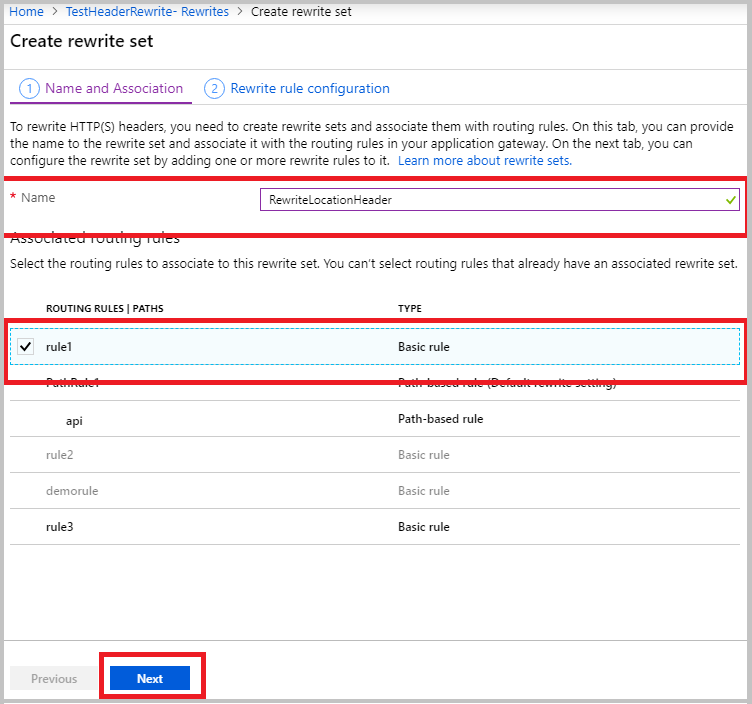
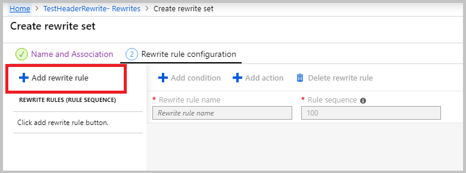
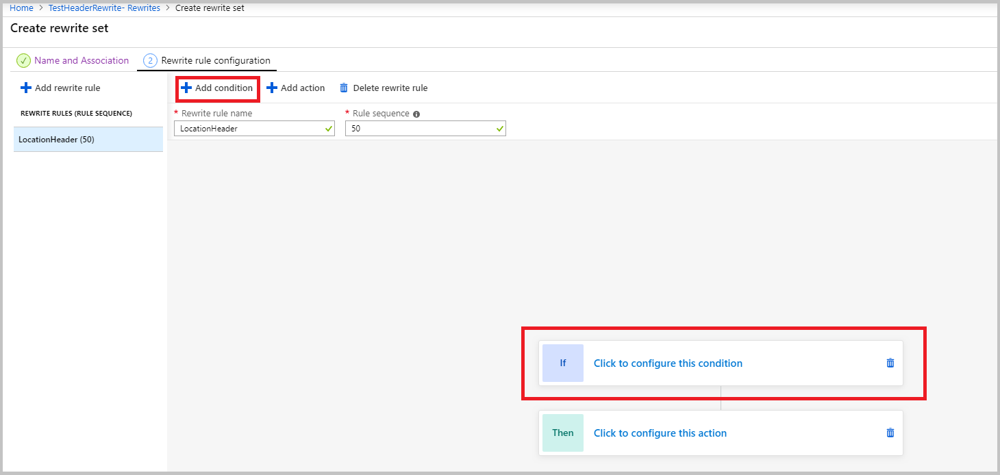
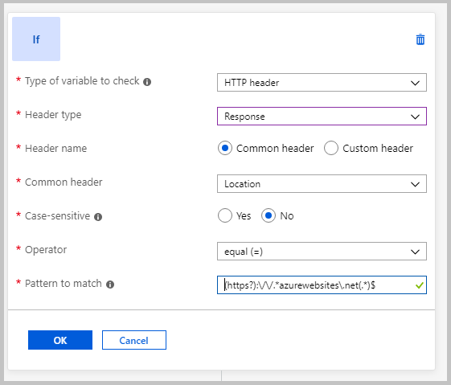
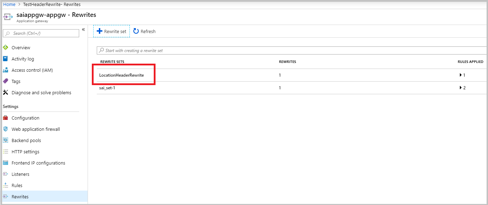

# Rewrite HTTP request and response headers with Azure Application Gateway - Azure portal

This article shows you how to use the Azure portal to configure an [Application Gateway v2 SKU](<https://docs.microsoft.com/azure/application-gateway/application-gateway-autoscaling-zone-redundant>)  to rewrite the HTTP headers in the requests and responses.

> [!IMPORTANT]
> The autoscaling and zone-redundant application gateway SKU is currently in public preview. This preview is provided without a service level agreement and is not recommended for production workloads. Certain features may not be supported or may have constrained capabilities. See the [Supplemental Terms of Use for Microsoft Azure Previews](https://azure.microsoft.com/support/legal/preview-supplemental-terms/) for details.

If you don't have an Azure subscription, create a [free account](https://azure.microsoft.com/free/?WT.mc_id=A261C142F) before you begin.

## Before you begin

You need to have an Application Gateway v2 SKU  since the header rewrite capability is not supported for the v1 SKU. If you don't have the v2 SKU, create an [Application Gateway v2 SKU](https://docs.microsoft.com/azure/application-gateway/tutorial-autoscale-ps>) before you begin.

## What is required to rewrite a header

To configure HTTP header rewrite, you will need to:

1. Create the new objects required to rewrite the http headers:

   - **Rewrite Action**: used to specify the request and request header fields that you intend to rewrite and the new value that the original headers need to be rewritten to. You can choose to associate one ore more rewrite condition with a rewrite action.

   - **Rewrite Condition**: It is an optional configuration. if a rewrite condition is added, it will evaluate the content of the HTTP(S) requests and responses. The decision to execute the rewrite action associated with the rewrite condition will be based whether the HTTP(S) request or response matched with the rewrite condition. 

     If more than one conditions are associated with an action, then the action will be executed only when all the conditions are met, i.e., a logical AND operation will be performed.

   - **Rewrite Rule**: rewrite rule contains multiple rewrite action - rewrite condition combinations.

   - **Rule Sequence**: helps determine the order in which the different rewrite rules get executed. This is helpful when there are multiple rewrite rules in a rewrite set. The rewrite rule with lesser rule sequence value gets executed first. If you provide the same rule sequence to two rewrite rules then the order of execution will be non-deterministic.

   - **Rewrite Set**: contains multiple rewrite rules which will be associated to a request routing rule.

2. You will be required to attach the rewrite set with a routing rule. This is because the rewrite configuration is attached to the source listener via the routing rule. When using a basic routing rule, the header rewrite configuration is associated with a source listener and is a global header rewrite. When a path-based routing rule is used, the header rewrite configuration is defined on the URL path map. So, it only applies to the specific path area of a site.

You can create multiple http header rewrite sets and each rewrite set can be applied to multiple listeners. However, you can apply only one rewrite set to a specific listener.

## Sign in to Azure

Sign in to the [Azure portal](https://portal.azure.com/) with your Azure account.

## Configure header rewrite

In this example, we will modify the redirection URL by rewriting the location header in the http response sent by the backend application. 

1. Select **All resources**, and then select your application gateway.

2. Select **Rewrites** from the left menu.

3. Click on **+Rewrite set**. 

   

4. Provide name to the rewrite set and associate it with a routing rule:

   - Enter the name of the rewrite set in the **Name** textbox.
   - Select one or more rules listed in the **Associated routing rules** list. You can only select those rules which have not been associated with other rewrite sets. The rules which have already been associated with other rewrite sets will be grayed out.
   - Click next.
   
     

5. Create a rewrite rule:

   - Click on **+Add rewrite rule**.
   - Provide a name to the rewrite rule in the Rewrite rule name textbox and Provide a rule sequence.

6. In this example, we will rewrite the location header only when it contains a reference to "azurewebsites.net". To do this, add a condition to evaluate whether the location header in the response contains azurewebsites.net:

   - Click on **+ Add condition** and then click on the section with the **If** instructions to expand it.

   - Select **HTTP header** from the **Type of variable to check** dropdown. 

   - Select **Header type** as **Response**.

   - Since in this example, we are evaluating the location header which happens to be a common header, select  **Common header** radio button as the **Header name**.

   - Select **Location** from the **Common header** dropdown.

   - Select **No** as the **Case-sensitive** setting.

   - Select **equal (=)** from the **Operator** dropdown.

   - Enter the regular expression pattern. In this example, we will use the pattern  `(https?):\/\/.*azurewebsites\.net(.*)$` .

   - Click **OK**.

     

7. Add an action to rewrite the location header:

   - Select **Set** as the **Action type**.

   - Select **Response** as the **Header type**.

   - Select **Common header** as the **Header name**.

   - Select **Location** from the **Common header** dropdown.

   - Enter the header value. In this example, we will use `{http_resp_Location_1}://contoso.com{http_resp_Location_2}` as the header value. This will replace *azurewebsites.net* with *contoso.com* in the location header.

   - Click **OK**.

     

8. Click on **Create** to create the rewrite set.

   

9. You will be navigated to the Rewrite set view. Verify that the rewrite set you created above is present in the list of rewrite sets.

   

## Next steps

To learn more about the configuration required to accomplish some of the common use cases, see [common header rewrite scenarios](https://docs.microsoft.com/azure/application-gateway/rewrite-http-headers).

   
