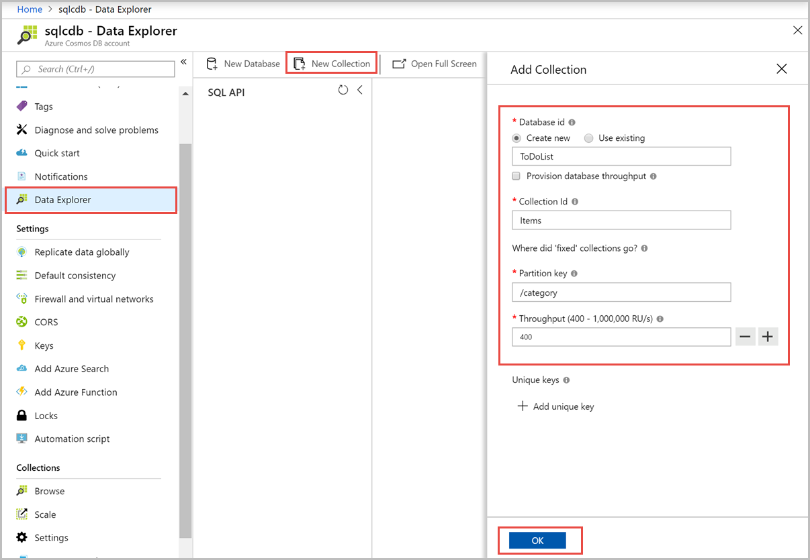
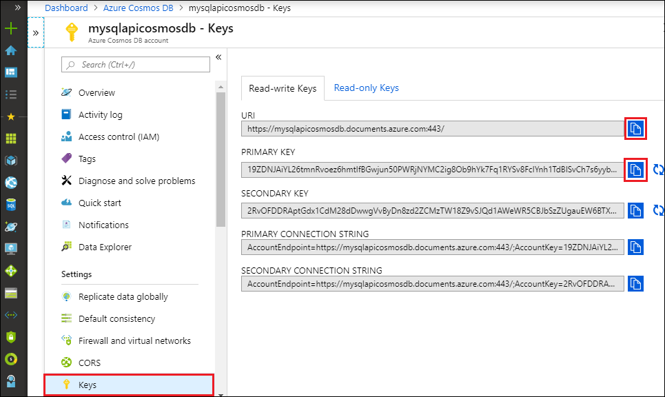
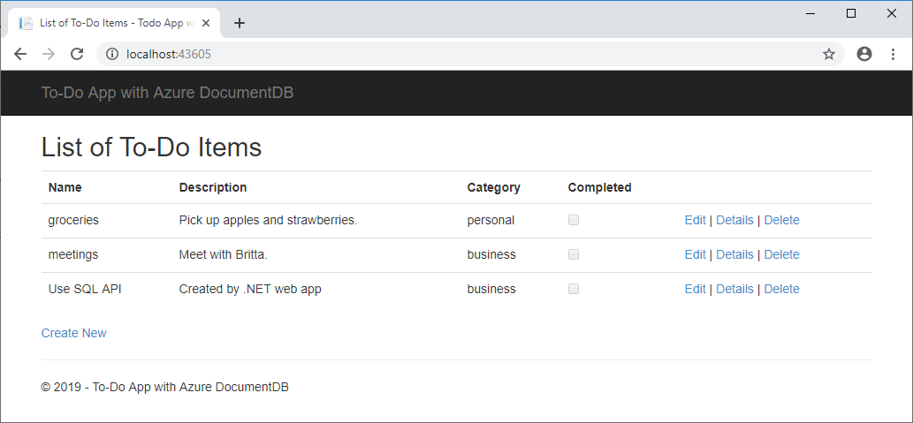

# Quickstart: Build a .NET web app using SQL API account in Azure Cosmos DB

> [!div class="op_single_selector"]
> * [.NET](create-sql-api-dotnet.md)
> * [.NET (Preview)](create-sql-api-dotnet-preview.md)
> * [Java](create-sql-api-java.md)
> * [Node.js](create-sql-api-nodejs.md)
> * [Python](create-sql-api-python.md)
> * [Xamarin](create-sql-api-xamarin-dotnet.md)
>  
> 

Azure Cosmos DB is Microsoft’s globally distributed multi-model database service. You can use Azure Cosmos DB to quickly create and query key/value databases, document databases, and graph databases, all of which benefit from the global distribution and horizontal scale capabilities at the core of Azure Cosmos DB. 

This quickstart demonstrates how to use the Azure portal to create an Azure Cosmos DB [SQL API](sql-api-introduction.md) account, create a document database and collection, and add data to the collection. You then use a [SQL .NET SDK](sql-api-sdk-dotnet.md) web app to add more data to the collection. 

In this quickstart, you use Data Explorer in the Azure portal to create the database and collection. You can also create the database and collection by using the .NET sample code. To learn more, see [Review the .NET code](#review-the-net-code). 

## Prerequisites

Visual Studio 2017 with the Azure development workflow installed
- You can download and use the **free** [Visual Studio 2017 Community Edition](https://www.visualstudio.com/downloads/). Make sure that you enable **Azure development** during the Visual Studio setup. 

An Azure subscription or free Azure Cosmos DB trial account
- [!INCLUDE [quickstarts-free-trial-note](../../includes/quickstarts-free-trial-note.md)] 
- [!INCLUDE [cosmos-db-emulator-docdb-api](../../includes/cosmos-db-emulator-docdb-api.md)]  

<a id="create-account"></a>
## Create an Azure Cosmos DB account

[!INCLUDE [cosmos-db-create-dbaccount](../../includes/cosmos-db-create-dbaccount.md)]

<a id="create-collection-database"></a>
## Add a database and a collection 

You can use the Data Explorer in the Azure portal to create a database and collection. 

1.  Select **Data Explorer** from the left navigation on your Azure Cosmos DB account page, and then select **New Collection**. 
    
    You may need to scroll right to see the **Add Collection** area.
    
    
    
1.  In the **Add collection** page, enter the settings for the new collection.
    
    |Setting|Suggested value|Description
    |---|---|---|
    |**Database id**|ToDoList|Enter *ToDoList* as the name for the new database. Database names must contain from 1 through 255 characters, and they cannot contain `/, \\, #, ?`, or a trailing space.|
    |**Collection id**|Items|Enter *Items* as the name for your new collection. Collection IDs have the same character requirements as database names.|
    |**Partition key**| /category| The sample described in this article uses */category* as the partition key.|
    |**Throughput**|400|Leave the throughput at 400 request units per second (RU/s). If you want to reduce latency, you can scale up the throughput later.| 
    
    Don't add **Unique keys** for this example. Unique keys let you add a layer of data integrity to the database by ensuring the uniqueness of one or more values per partition key. For more information, see [Unique keys in Azure Cosmos DB](unique-keys.md).
    
1.  Select **OK**. 
    Data Explorer displays the new database and collection.
    
    

## Add data to your database

Add data to your new database using Data Explorer.

1. In **Data Explorer**, the new database appears in the **Collections** pane. Expand the **ToDoList** database, expand the **Items** collection, select **Documents**, and then select **New Document**. 
   
   
   
1. Add the following structure to the document on the right side of the **Documents** pane:

     ```json
     {
         "id": "1",
         "category": "personal",
         "name": "groceries",
         "description": "Pick up apples and strawberries.",
         "isComplete": false
     }
     ```

1. Select **Save**.
   
   
   
1. Select **New Document** again, and create and save another document with a unique `id`, and any other properties and values you want. Your documents can have any structure, because Azure Cosmos DB doesn't impose any schema on your data.

## Query your data

[!INCLUDE [cosmos-db-create-sql-api-query-data](../../includes/cosmos-db-create-sql-api-query-data.md)]

## Use the .NET web app to manage data

To see how easy it is to work with your Azure Cosmos DB data programmatically, clone the sample SQL API .NET web app from GitHub, update the connection string, and run the app to update your data. 

You could also create the database and collection by using the .NET sample code. To learn more, see [Review the .NET code](#review-the-net-code).

### Clone the sample app

First, clone a C# [SQL API app](https://github.com/Azure-Samples/documentdb-dotnet-todo-app) from GitHub. 

1. Open a git terminal window, such as Git Bash, create a new directory named *git-samples*, and change to it: 
   
   ```bash
   mkdir /c/git-samples/
   cd /c/git-samples/
   ```
   
1. Run the following command to clone the sample repository and create a copy of the sample app on your computer:
   
   ```bash
   git clone https://github.com/Azure-Samples/documentdb-dotnet-todo-app.git
   ```

### Update the connection string 

1. Navigate to and open the *todo.sln* file of your cloned app in Visual Studio. 

1. In Visual Studio **Solution Explorer**, open the *web.config* file. 

1. Go back to the Azure portal to copy your connection string information to paste into the *web.config*.
   
   1. In your Azure Cosmos DB account left navigation, select **Keys**.
      
      
      
   1. Under **Read-write Keys**, copy the **URI** value using the copy button at the right, and paste it into the `endpoint` key in the *web.config*. For example: 
      
      `<add key="endpoint" value="https://mysqlapicosmosdb.documents.azure.com:443/" />`
      
   1. Copy the **PRIMARY KEY** value and paste it into the `authKey` key in the *web.config*. For example:
      
      `<add key="authKey" value="19ZDNJAiYL26tmnRvoez6hmtIfBGwjun50PWRjNYMC2ig8Ob9hYk7Fq1RYSv8FcIYnh1TdBISvCh7s6yyb0000==" />`

       
1. Make sure the database and collection values in the *web.config* match the names you created earlier. 

   ```csharp
   <add key="database" value="ToDoList"/>
   <add key="collection" value="Items"/>
   ```
 
1. Save the *web.config.* You've now updated your app with all the information it needs to communicate with Azure Cosmos DB.

### Run the web app

1. In Visual Studio, right-click the **todo** project in **Solution Explorer**, and then select **Manage NuGet Packages**. 

1. In the NuGet **Browse** box, type *DocumentDB*.

1. From the results, install the **Microsoft.Azure.DocumentDB** library if not already installed. This installs the [Microsoft.Azure.DocumentDB](https://www.nuget.org/packages/Microsoft.Azure.DocumentDB/) package and all dependencies.
   
   If the NuGet Package Manager displays a message that some packages are missing from the solution, select **Restore** to install them from internal sources. 

1. Select **Ctrl**+**F5** to run the app in your browser. 

1. Select **Create New** in the to-do app, and create a few new tasks.

   

You can go back to Data Explorer in the Azure portal to see, query, modify, and work with your new data. 

## Review the .NET code

This step is optional. In this quickstart, you created a database and a collection in the Azure portal and added sample data by using the .NET sample. However, you can also create the database and the collection by using the .NET sample. Review the following snippets if you're interested in how database resources are created in the code. The snippets are all taken from the *DocumentDBRepository.cs* file in the **todo** project.

* This code initializes the `DocumentClient`: 

    ```csharp
    client = new DocumentClient(new Uri(ConfigurationManager.AppSettings["endpoint"]), ConfigurationManager.AppSettings["authKey"]);
    ```

* This code creates the new database by using the `CreateDatabaseAsync` method:

    ```csharp
    await client.CreateDatabaseAsync(new Database { Id = DatabaseId });
    ```

* The following code creates the new collection by using the `CreateDocumentCollectionAsync` method:

    ```csharp
    private static async Task CreateCollectionIfNotExistsAsync()
    {
        try
        {
           await client.ReadDocumentCollectionAsync(UriFactory.CreateDocumentCollectionUri(DatabaseId, CollectionId));
        }
        catch (DocumentClientException e)
        {
           if (e.StatusCode == System.Net.HttpStatusCode.NotFound)
           {
              await client.CreateDocumentCollectionAsync(
              UriFactory.CreateDatabaseUri(DatabaseId),
              new DocumentCollection
              {
                  Id = CollectionId
              },
              new RequestOptions { OfferThroughput = 400 });
           }
           else
           {
             throw;
           }
        }
    }
    ```

## Clean up resources

[!INCLUDE [cosmosdb-delete-resource-group](../../includes/cosmos-db-delete-resource-group.md)]

## Next steps

In this quickstart, you learned how to create an Azure Cosmos DB account, create a database and collection using the Data Explorer, and run a .NET web app to update your data. You can now import additional data to your Azure Cosmos DB account. 

> [!div class="nextstepaction"]
> [Import data into Azure Cosmos DB](import-data.md)

